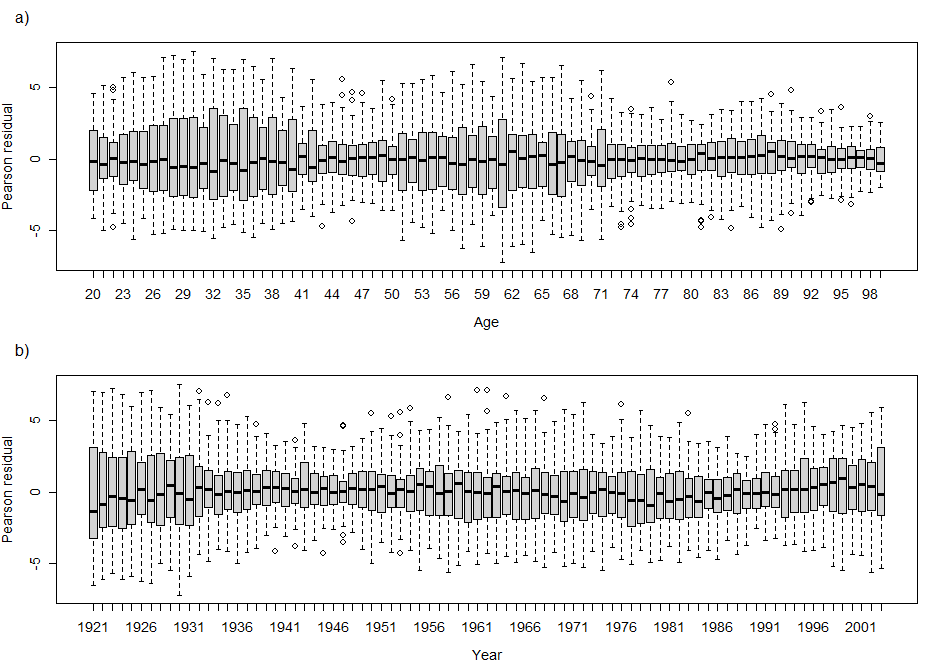
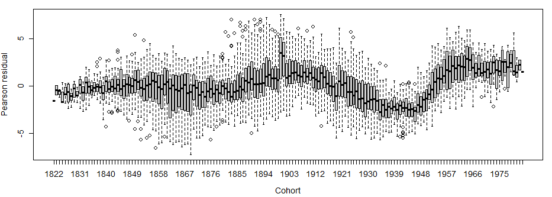
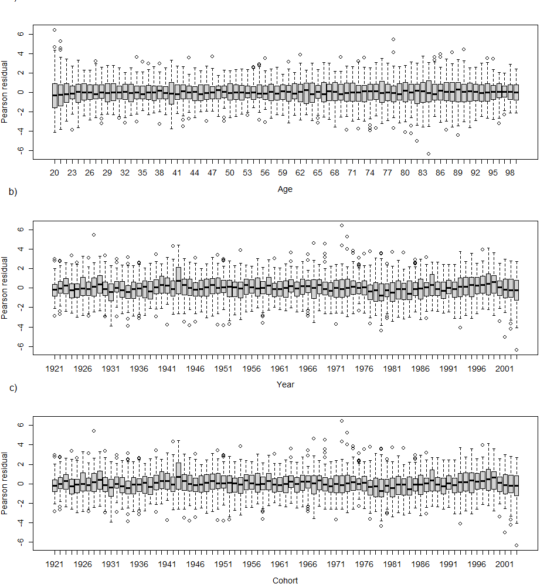
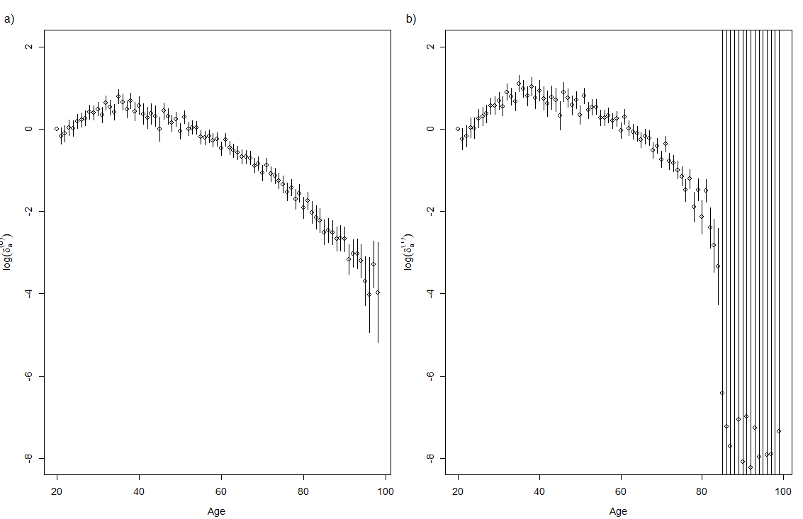

Modelling Mortality Trends with the Lee-Carter Model
================

## Loading required packages

``` r
library(gnm)
library(splines)
```

## Pre-processing the Data

The downloaded files of deaths and exposures are read into R using
`read.table`, in each case creating a data frame with the variables

1.  `Year`: ranging from `1921` to year of download
2.  `Age`: ranging from `0` to `110+`
3.  `Female`: number of females that died/were exposed to risk
4.  `Male`: number of males that died/were exposed to risk

``` r
deaths <- read.table(params$deaths, header = TRUE)
exposures <- read.table(params$exposures, header = TRUE)
```

This case study considers data up to 2003:

``` r
deaths <- subset(deaths, Year < 2004)
exposures <- subset(exposures, Year < 2004)
```

The data are extracted for ages 20-99 (younger and older ages are
expected to exhibit different behaviour so are omitted).

``` r
deaths <- subset(deaths, Age > 19 & Age < 100)
exposures <- subset(exposures, Age > 19 & Age < 100)
```

Finally the data for males are combined into a single data frame as
follows:

``` r
Canada <- data.frame(Year = as.factor(deaths$Year),
                     Age = as.factor(deaths$Age),
                     Deaths = deaths$Male,
                     Exposure = exposures$Male)
rm(deaths, exposures)
```

## Modelling

### Lee-Carter Model

We first fit a simple model with age (`Age`) and period (`Year`)
effects. Since over-dispersion is expected we use the `"quasipoisson"`
family, which like the `"poisson"` family uses a log link by default.
The `offset` argument is used to adjust for the exposure, to give a
model for the expected **rate**. The effect of `Age` could be included
in the main model formula, but here we use `eliminate` so that the 80
parameters this term involves are computed more efficiently.

``` r
APmodel <- gnm(Deaths ~ Year,
               offset = log(Exposure), eliminate = Age,
               family = "quasipoisson", data = Canada,
               verbose = FALSE)
```

The coefficients from the age-period model are extracted to provide
starting values for the Lee-Carter model. The number of starting values
should be equal to the number of parameters or the number of
non-eliminated parameters in the model. Here we include starting values
for the eliminated `Age` parameters. Note that the `Year` parameters in
the `APmodel` are linear and hence the usual constraints are applied.
Therefore to set starting values for the overparameterised `Year`
multipliers we need to add in the zero for the first `Year` parameter.
We use `Exp` to ensure that the age multipliers are non-negative and set
the starting values of the corresponding parameters to zero so that the
age multipliers are initiated at one.

``` r
AgeCoef <- attr(coef(APmodel), "eliminated")
YearCoef <- coef(APmodel)
na <- length(AgeCoef)
LCmodel <- update(APmodel, . ~ Mult(Exp(Age), Year),
                  start = c(AgeCoef, rep(0, na), 0, YearCoef))
dev <- c("LC" = deviance(LCmodel))
```

``` r
dev["LC"]
```

          LC 
    32422.68 

We first evaluate the model by plotting the residuals by `Age` and
`Year`:

``` r
Canada$LC_res <- residuals(LCmodel, type = "pearson")
```

``` r
par(mfrow = c(2,1), mar = c(4.5, 4.1, 3.1, 1.1), cex = 0.9, mex = 0.8,
    oma = c(0, 0, 0, 0))
with(Canada,{
    plot(Age, LC_res, xlab="Age", ylab="Pearson residual")
    mtext("a)", side = 2, line = 2, at = 10, las = 2)
    plot(Year, LC_res, xlab="Year", ylab="Pearson residual")
    mtext("b)", side = 2, line = 2, at = 10, las = 2)
})
```



Then we define a yearly cohort factor and plot the residuals against
this:

``` r
Canada$Cohort <- factor(as.numeric(as.character(Canada$Year)) -
                        as.numeric(as.character(Canada$Age)))
```

``` r
par(mfrow = c(1,1), mar = c(4.5, 4.1, 1.1, 1.1), cex = 0.9, mex = 0.8,
    oma = c(0, 0, 0, 0))
with(Canada, plot(Cohort, LC_res, xlab="Cohort", ylab="Pearson residual"))
```



### Age-Period-Cohort Model

As for the Lee-Carter model, we start from a generalized linear model,
now with an additional `Cohort` effect.

``` r
APCmodel_GLM <- gnm(Deaths ~ Year + Cohort, eliminate = Age,
                    offset = log(Exposure), family = "quasipoisson",
                    data = Canada, verbose = FALSE)
dev["APC_GLM"] <- deviance(APCmodel_GLM)
```

``` r
dev["APC_GLM"]
```

     APC_GLM 
    24730.12 

Then we extract the coefficients to use as starting values for the
Age-Period-Cohort model

``` r
AgeCoef <- attr(coef(APCmodel_GLM), "eliminated")
YearCoef <- pickCoef(APCmodel_GLM, "Year", value = TRUE)
CohortCoef <- pickCoef(APCmodel_GLM, "Cohort", value = TRUE)
```

We find it necessary to constrain the multiplier of year to be zero for
age 99. This is implemented by constraining the log-multiplier to
`-1000`. (This model does not converge for the simulated data, so the
maximum number of iterations has been fixed to handle this case.)

``` r
start <- c(AgeCoef, rep(0, na), 0, YearCoef, rep(0, na), 0, CohortCoef)
APCmodel_GNM <- update(APCmodel_GLM,
                       . ~ Mult(Exp(Age), Year) + Mult(Exp(Age), Cohort),
                       constrain = 80, constrainTo = -1000,
                       start = start, iterMax = 60)
dev["APC_GNM"]<- deviance(APCmodel_GNM)
```

``` r
dev["APC_GNM"]
```

     APC_GNM 
    10103.65 

As before, the model is evaluated by plotting the residuals against
`Age`, `Year` and `Cohort`.

``` r
Canada$APC_res <- residuals(APCmodel_GNM, type = "pearson")
```

``` r
par(mfrow = c(3,1), mar = c(4.5, 4.1, 3.1, 1.1), cex = 0.9, mex = 0.8,
    oma = c(0, 0, 0, 0))
with(Canada,{
    plot(Age, APC_res, xlab="Age", ylab="Pearson residual")
    mtext("a)", side = 2, line = 2, at = 10, las = 2)
    plot(Year, APC_res, xlab="Year", ylab="Pearson residual")
    mtext("b)", side = 2, line = 2, at = 10, las = 2)
    plot(Year, APC_res, xlab="Cohort", ylab="Pearson residual")
    mtext("c)", side = 2, line = 2, at = 10, las = 2)
})
```



Simple contrasts of the age multipliers are again found with
`getContrasts`. Given the large number of parameters in the model we use
`check = FALSE` to avoid the checks on estimability of the contrasts,
which would take several minutes. Therefore we must first omit the
multiplier for age 99 that was constrained in the model fit.

``` r
AgeContrasts <- list()
AgeMult1 <- pickCoef(APCmodel_GNM,  "Mult(Exp(.), Year)", fixed = TRUE)
AgeMult1 <- AgeMult1[-length(AgeMult1)]
AgeMult2 <- pickCoef(APCmodel_GNM,  "Mult(Exp(.), Cohort)", fixed = TRUE)
AgeContrasts[[1]] <- getContrasts(APCmodel_GNM, AgeMult1, check = FALSE)
AgeContrasts[[2]] <- getContrasts(APCmodel_GNM, AgeMult2, check = FALSE)
```

The resulting contrasts are plotted as follows:

``` r
par(mfrow = c(1, 2), mar = c(4.5, 4.5, 3.1, 1.1), cex = 0.9, mex = 0.8,
    oma = c(0, 0, 0, 0))
lab <- c("a)", "b)")
for (i in 1:2) {
    estimate <- AgeContrasts[[i]]$qvframe$estimate
    SE <- AgeContrasts[[i]]$qvframe$SE
    tops <- estimate + (2 * SE)
    tails <- estimate - (2 * SE)
    range <- max(tops) - min(tails)
    #ylim <- c(min(tails) - range/10, max(tops) + range/10)
    ylim <- c(-8, 2)
    xvalues <- seq(length(estimate)) + 19
    plot(xvalues, estimate, xlab = "Age",
         ylab = substitute(log(delta[a]^(e)), list(e = i - 1)),
         ylim = ylim)
    segments(xvalues, tails, xvalues, tops)
    mtext(lab[i], side = 2, line = 3, at = 2.7, las = 2)
}
```



Finally we consider a model in which the yearly age multipliers are
replaced by a linear spline (This model does not converge for the
simulated data, so the maximum number of iterations has been fixed to
handle this case.)

``` r
Age2 <- as.numeric(as.character(Canada$Age))
X2 <- bs(Age2,  knots = c(seq(25, 70, by = 5), 80), degree = 1)
nx <- ncol(X2)
start <- c(AgeCoef, rep(0, nx), 0,  YearCoef, rep(0, nx), 0, CohortCoef)

APCmodel_spline <- update(APCmodel_GLM,
                          . ~ Mult(Exp(X2), Year) + Mult(Exp(X2), Cohort),
                          start = start, iterMax = 65)
dev["APC_spline"] <- deviance(APCmodel_spline)
```

``` r
dev["APC_spline"]
```

    APC_spline 
      12485.59 

We compute the percentage of the difference in deviance between the
linear and nonlinear Age-Period-Cohort models explained by the spline
model, as a measure of its adequacy.

``` r
(dev["APC_GLM"] - dev["APC_spline"])/(dev["APC_GLM"] - dev["APC_GNM"])
```

      APC_GLM 
    0.8371487 
