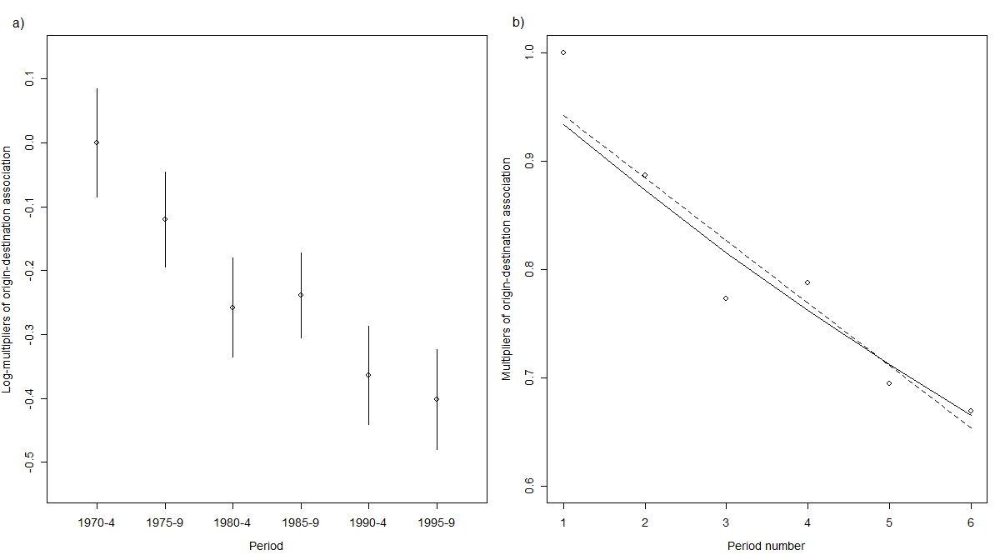
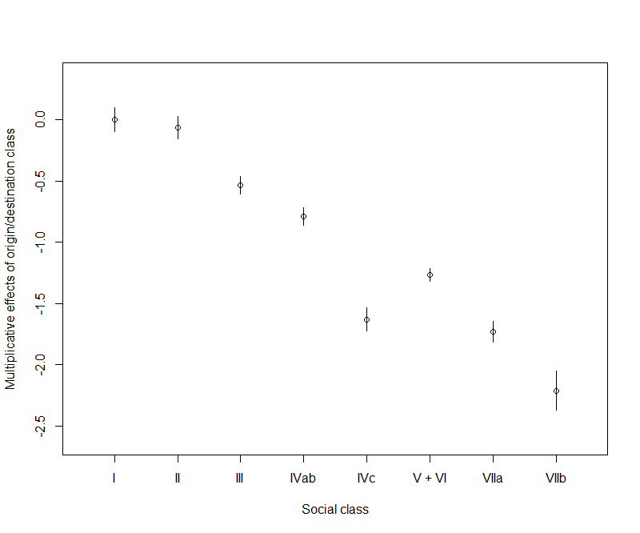
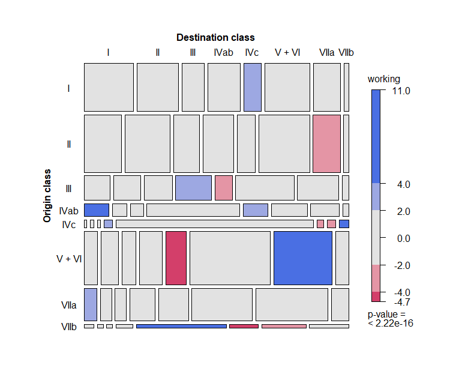

Comparing Social Mobility across Countries with the UNIDIFF Model
================

## Loading required packages

``` r
library(gnm)
library(vcdExtra)
```

## Pre-processing the Data

The survey data is read into R, selecting the variables of interest: the
five-year period, the eight-category social class variable for father
and respondent, and the weighted frequencies. The period and social
class variables are converted to factors.

``` r
allMen <- read.table(params$data, header = FALSE)[, c(4, 10, 12, 14)]
colnames(allMen) <- c("period", "origin8", "dest8", "wFreq")
allMen[,1:3] <- lapply(allMen[, 1:3], factor)
```

Following the analysis by Ganzeboom and Luijkx (in Social Mobility in
Europe, ed. R. Breen, 2004), we collapse the data by the factors
`period`, `origin8`, and `dest8`.

``` r
dataI <- as.data.frame(xtabs(wFreq ~ period + origin8 + dest8, data = allMen))
```

Since the response is a weighted frequency, the resulting counts are
non-integer. This generates multiple warnings during the model fitting,
which are suppressed in the output below. \#\# Modelling We first fit
the conditional independence model as a baseline (the model names refer
to the names used in Ganzeboom and Luijkx, 2004):

``` r
modelA <- suppressWarnings(gnm(Freq ~ -1 + period:origin8 + period:dest8,
                               family = poisson, data = dataI, verbose = FALSE))
```

Then we update this model to the unstructured UNIDIFF model, using `Exp`
to ensure the period multipliers are non-negative and the `ofInterest`
argument to mark these parameters as the only ones that should be
included in model summaries.

``` r
modelC <- update(modelA, . ~ . + Mult(Exp(period), origin8:dest8),
                 ofInterest = "[.]period")
dev <- c("C" = deviance(modelC))
df <- c("C" = df.residual(modelC))
```

``` r
dev["C"]
```

           C 
    274.0539 

``` r
df["C"]
```

      C 
    240 

The `getContrasts()` function is used to obtain simple contrasts of the
log-multipliers along with their quasi-variances:

``` r
periodContr <- getContrasts(modelC, ofInterest(modelC))
```

``` r
summary(periodContr)
```

    Model call:  gnm(formula = Freq ~ period:origin8 + period:dest8 + Mult(Exp(period),      origin8:dest8) - 1, ofInterest = "[.]period", family = poisson,      data = dataI, verbose = FALSE) 
                                              estimate         SE    quasiSE    quasiVar
        Mult(Exp(.), origin8:dest8).period1  0.0000000 0.00000000 0.04217110 0.001778402
        Mult(Exp(.), origin8:dest8).period2 -0.1199671 0.05566766 0.03692355 0.001363349
        Mult(Exp(.), origin8:dest8).period3 -0.2578908 0.05734589 0.03883877 0.001508450
        Mult(Exp(.), origin8:dest8).period4 -0.2386332 0.05383439 0.03352018 0.001123603
        Mult(Exp(.), origin8:dest8).period5 -0.3643565 0.05729768 0.03844435 0.001477968
        Mult(Exp(.), origin8:dest8).period6 -0.4020130 0.05783211 0.03926997 0.001542130
    Worst relative errors in SEs of simple contrasts (%):  -0.4 0.7 
    Worst relative errors over *all* contrasts (%):  -1.3 0.7 

We then consider two models suggested by Ganzeboom and Luijkx, with
either a linear or quadratic dependence of the multipliers on period
number.

``` r
modelD <- update(modelA, . ~ . + Mult(Const(1) + as.numeric(period),
                                      origin8:dest8),
                 ofInterest = "[.]as")
modelE <- update(modelA, . ~ . +
                 Mult(Const(1) + as.numeric(period)+ I(as.numeric(period)^2),
                      origin8:dest8),
                 ofInterest = "[.]as")
dev <- c(dev, "D" = deviance(modelD), "E" = deviance(modelE))
df <- c(df, "D" = df.residual(modelD), "E" = df.residual(modelE))
```

``` r
dev[c("D", "E")]
```

           D        E 
    280.2863 278.0486 

``` r
df[c("D", "E")]
```

      D   E 
    244 243 

Finally we propose a model in which the log-multipliers depend on period
number – note a `Const` term is unnecessary here as this would simply
scale the multipliers by a constant.

``` r
modelEa <- update(modelA, . ~ . + Mult(Exp(as.numeric(period)), origin8:dest8),
                  ofInterest = "[.]as")
dev <- c(dev, "Ea" = deviance(modelEa))
df <- c(df, "Ea" = df.residual(modelEa))
```

``` r
dev["Ea"]
```

          Ea 
    279.1225 

``` r
df["Ea"]
```

     Ea 
    244 

Having considered a selection of models, we impose some identifiability
constraints, for presentational purposes. For the UNIDIFF model, we
constrain the log-multiplier for the first period to 0:

``` r
modelC <- update(modelC, constrain = "[.]period1", constrainTo = 0)
```

For the structured UNIDIFF models, we fix the origin-destination
interaction as in `modelC` - note that this constraint slightly impairs
model fit, but enables the multipliers to be directly compared as in the
plot below.

``` r
keep <- pickCoef(modelC, "[.]origin")
modelD <- update(modelD, constrain = "[.]origin",
                 constrainTo = coef(modelC)[keep],
                 ofInterest = "[.]as")
modelEa <- update(modelEa, constrain = "[.]origin",
                  constrainTo = coef(modelC)[keep],
                  ofInterest = "[.]as")
```

A plot of the period contrasts from the UNIDIFF model and a second plot
of the corresponding scaling factors are created as follows. The points
are joined by lines in the second plot to highlight the trends in the
estimates.

``` r
par(mfrow = c(1,2), mar = c(4.5, 4.1, 3.1, 1.1), cex = 0.9, mex = 0.8,
    oma = c(0, 0, 0, 0))
plot(periodContr, xaxt = "n", xlab = "Period",
     ylab = "Log-multipliers of origin-destination association",
     main = "")
axis(1, lab = c("1970-4", "1975-9", "1980-4", "1985-9", "1990-4", "1995-9"),
     at = 1:6)
mtext("a)", side = 2, line = 2, at = 0.19, las = 2)
plot(1:6, exp(parameters(modelC)[ofInterest(modelC)]), ylim = c(0.6, 1.0),
     xlab = "Period number",
     ylab = "Multipliers of origin-destination association")
lines(1:6, 1 + coef(modelD)[ofInterest(modelD)]*1:6, lty = 2)
lines(1:6, exp(coef(modelEa)[ofInterest(modelEa)]*1:6), lty = 1)
mtext("b)", side = 2, line = 2, at = 1.03, las = 2)
```



We finally consider the Goodman-Hauser model selected by Ganzeboom and
Luijkx:

``` r
modelJ <- update(modelA, . ~ . + Diag(origin8, dest8) +
                 Mult(Const(1) + as.numeric(period), MultHomog(origin8, dest8)),
                 etastart = modelA$predictors)
dev <- c(dev, "J" = deviance(modelJ))
df <- c(df, "J" = df.residual(modelJ))
```

``` r
dev["J"]
```

           J 
    604.9599 

``` r
df["J"]
```

      J 
    278 

This time we focus on the homogenous multiplicative effects of
origin/destination class, using `getContrasts` to obtain the simple
contrasts of these parameters for summary and display:

``` r
classContr <- getContrasts(modelJ, pickCoef(modelJ, "[.]origin"))
```

``` r
summary(classContr)
```

    Model call:  gnm(formula = Freq ~ period:origin8 + period:dest8 + Diag(origin8,      dest8) + Mult(Const(1) + as.numeric(period), MultHomog(origin8,      dest8)) - 1, family = poisson, data = dataI, etastart = modelA$predictors,      verbose = FALSE) 
                                                                                          estimate         SE    quasiSE     quasiVar
        Mult(as.numeric(period) + Const(1), .)MultHomog(origin8, dest8).origin8|dest81  0.00000000 0.00000000 0.04859824 0.0023617888
        Mult(as.numeric(period) + Const(1), .)MultHomog(origin8, dest8).origin8|dest82 -0.06374475 0.06997714 0.04582272 0.0020997219
        Mult(as.numeric(period) + Const(1), .)MultHomog(origin8, dest8).origin8|dest83 -0.53551115 0.05781930 0.03678566 0.0013531848
        Mult(as.numeric(period) + Const(1), .)MultHomog(origin8, dest8).origin8|dest84 -0.79034411 0.05999170 0.03641297 0.0013259040
        Mult(as.numeric(period) + Const(1), .)MultHomog(origin8, dest8).origin8|dest85 -1.62998425 0.07057345 0.04889132 0.0023903607
        Mult(as.numeric(period) + Const(1), .)MultHomog(origin8, dest8).origin8|dest86 -1.26809664 0.05553197 0.02720743 0.0007402441
        Mult(as.numeric(period) + Const(1), .)MultHomog(origin8, dest8).origin8|dest87 -1.72849449 0.06437025 0.04232770 0.0017916338
        Mult(as.numeric(period) + Const(1), .)MultHomog(origin8, dest8).origin8|dest88 -2.21159697 0.09533835 0.07885548 0.0062181860
    Worst relative errors in SEs of simple contrasts (%):  -4.7 6.2 
    Worst relative errors over *all* contrasts (%):  -12.3 17 

``` r
plot(classContr, xaxt = "n", xlab = "Social class",
     ylab = "Multiplicative effects of origin/destination class",
     main = "")
axis(1, lab = c("I", "II", "III", "IVab", "IVc", "V + VI", "VIIa", "VIIb"),
     at = 1:8)
```



We evaluate the fit of this model by plotting the aggregate residuals:

``` r
mosaic(modelJ, ~origin8 + dest8,
       set_varnames =
       list(origin8 = "Origin class", dest8 = "Destination class"),
       set_labels =
       list(origin8 = c("I", "II", "III", "IVab", "IVc", "V + VI", "VIIa", "VIIb"),
       dest8 = c("I", "II", "III", "IVab", "IVc", "V + VI", "VIIa", "VIIb")),
       rot_labels = c(0, 0), offset_varnames = c(0.3, 0, 0, 1.3),
       offset_labels = c(0, 0, 0, 0.3), margins = c(1, 1, 0, 4))
```



## References

Ganzeboom, Harry B. G., and Ruud Luijkx. 2004. “Recent trends in
intergenerational occupational class reproduction in the Netherlands
1970-99.” In *Social Mobility in Europe*, edited by Richard Breen,
345–81. Oxford University Press.
